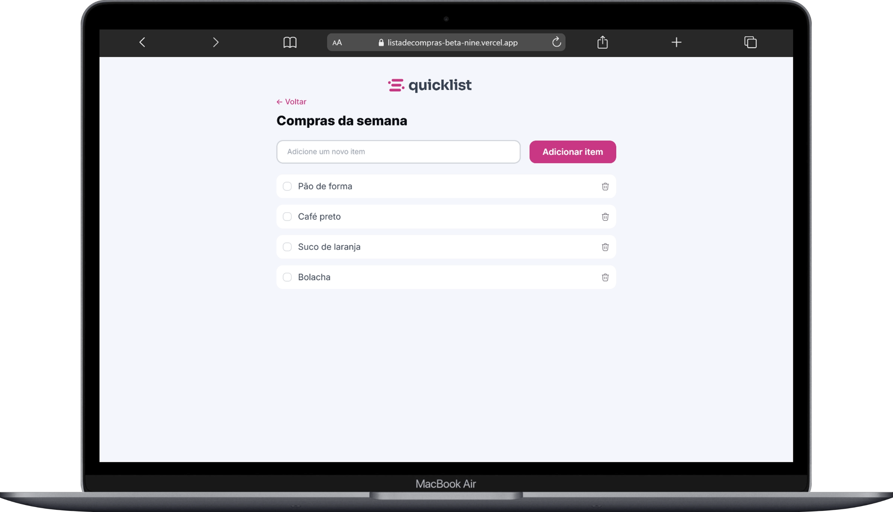
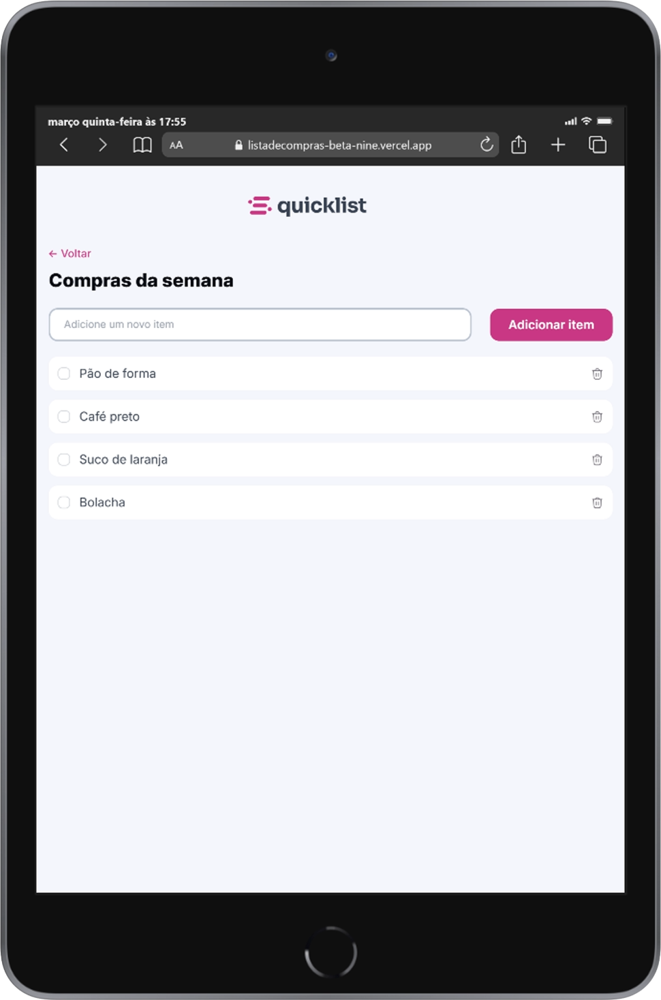
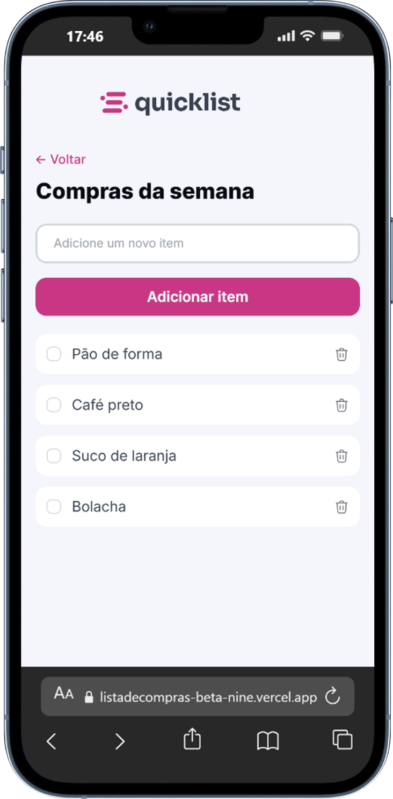

# 📋 Lista de Compras

Aplicação web simples e funcional para gerenciar uma lista de compras diretamente no navegador.

🔗 **Acesse o projeto:**  
👉 https://listadecompras-beta-nine.vercel.app/

---

## 🚀 Funcionalidades

O projeto foi desenvolvido seguindo uma checklist de requisitos para garantir organização, usabilidade e qualidade da aplicação:

### 🧾 Estrutura e Interação
- [x] Limpar o campo após adicionar um item  
- [x] Adicionar item ao pressionar o botão ou tecla Enter  
- [x] Impedir adição de itens vazios  

### 📋 Manipulação da Lista
- [x] Inserir itens dinamicamente na lista  
- [x] Aplicar estilos para os itens adicionados  
- [x] Separar itens com espaçamento adequado

### ❌ Remoção de Itens
- [x] Criar botão de remover item  
- [x] Remover item da lista ao clicar no botão  
- [x] Exibir mensagem de feedback ao remover  

---

## 🖥️ Preview

- 💻 Desktops  
- 📟 Tablets  
- 📱 Smartphones  

  
  
  

  Interface moderna, intuitiva e <strong>totalmente responsiva</strong>, garantindo uma ótima experiência em qualquer dispositivo.

---

## 🛠️ Tecnologias utilizadas

- HTML5  
- CSS3  
- JavaScript
- Vercel (Deploy)